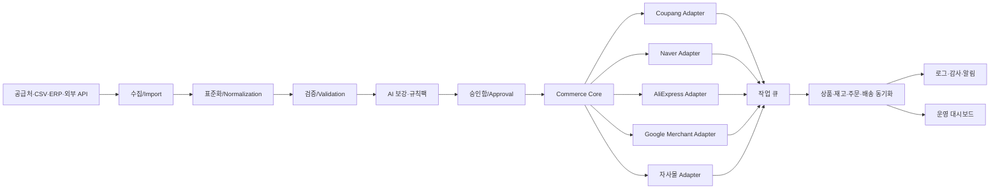

# 범용 쇼핑몰 자동화 플랫폼 기획안

> 문서 버전: Draft v0.1  
> 작성 기준일: 2026-06-30  
> 저장소: `1976haru/shop`  
> 작업명: **Commerce Automation Hub**

---

## 1. 한 줄 정의

여러 쇼핑몰과 공급처를 하나의 공통 데이터 모델로 연결하고, 상품 수집·가공·등록·재고·가격·주문·배송·반품·정산·CS를 채널별 어댑터와 업종별 규칙팩으로 자동화하는 범용 커머스 운영 플랫폼이다.

---

## 2. 왜 이 구조로 만드는가

건강기능식품, 농산물, 쿠팡, 네이버 스마트스토어, 해외 소싱은 표면적으로 달라 보이지만 실제 운영 흐름의 대부분은 같다.

1. 공급처 또는 원본 데이터에서 상품을 가져온다.
2. 상품명·옵션·가격·이미지·상세설명을 표준화한다.
3. 판매 채널의 카테고리와 필수 속성에 맞게 변환한다.
4. 상품을 등록하거나 수정한다.
5. 재고와 가격을 계속 동기화한다.
6. 주문을 수집하고 공급·출고 시스템으로 전달한다.
7. 송장, 취소, 반품, 교환을 처리한다.
8. 판매·광고·정산 데이터를 분석한다.

따라서 채널마다 별도 프로그램을 만드는 대신 다음 세 층으로 분리한다.

- **공통 코어:** 상품, SKU, 재고, 가격, 주문, 배송, 반품, 정산, 작업 이력
- **채널 어댑터:** 쿠팡, 네이버, 알리익스프레스, 자사몰, Google Merchant 등
- **업종 규칙팩:** 건강기능식품, 농산물, 해외구매대행, 일반 공산품 등

이 구조의 핵심은 “한 번 만든 공통 기능을 계속 재사용하고, 다른 부분만 플러그인처럼 교체하는 것”이다.

---

## 3. 목표

### 3.1 제품 목표

- 한 화면에서 여러 판매 채널의 상품·재고·주문 상태를 관리한다.
- 공급처 데이터 형식이 달라도 내부에서는 하나의 표준 형식으로 다룬다.
- 채널별 API 차이는 어댑터 내부에 감춘다.
- 실패한 자동화 작업을 추적하고 안전하게 재시도한다.
- AI는 문구 생성보다 분류·검수·이상 탐지·업무 보조에 우선 사용한다.
- 자동 등록 전에 `미리보기 → 검증 → 승인 → 실행` 단계를 둔다.
- 개인용 자동화에서 시작해 향후 다계정 SaaS로 확장할 수 있게 만든다.

### 3.2 사업 목표

- 1차: 사용자가 직접 운영하는 쇼핑몰의 반복 업무 절감
- 2차: 업종별 자동화 템플릿과 채널 커넥터 판매
- 3차: 소규모 판매자를 위한 구독형 운영 도구
- 4차: 셀러·공급사 대상 구축형 솔루션과 유지관리 서비스

---

## 4. 하지 않을 것

초기부터 모든 기능을 넣으면 완성 전에 구조가 무너질 가능성이 높다. 다음 항목은 초기 MVP 범위에서 제외한다.

- 모든 국내외 마켓 동시 지원
- 판매 채널 약관을 우회하는 무단 크롤링
- 사람의 승인 없이 대량 상품을 즉시 공개하는 기능
- 구매자 개인정보를 불필요하게 장기 보관하는 기능
- 건강기능식품 효능 표현을 AI가 임의로 생성해 바로 게시하는 기능
- 완전 자동 광고 집행 및 무제한 자동 가격 경쟁
- 초기에 마이크로서비스로 과도하게 분리하는 설계
- 공식 API 없이 브라우저 자동화만으로 핵심 운영을 구성하는 방식

---

## 5. 핵심 설계 원칙

### 5.1 모듈형 모놀리스 우선

초기에는 하나의 배포 단위로 만들되 내부 모듈 경계를 명확히 한다. 트래픽이나 팀 규모가 실제로 커졌을 때 작업 큐, AI 처리, 채널 동기화 모듈부터 분리한다.

### 5.2 API 우선, 브라우저 자동화는 보조

- 공식 API가 있으면 공식 API를 사용한다.
- 브라우저 자동화는 API가 제공하지 않는 허용된 보조 작업에만 사용한다.
- 사이트 약관, 로봇 정책, 개인정보 처리 기준을 우회하지 않는다.

### 5.3 내부 표준 모델이 중심

판매 채널의 데이터 구조를 그대로 데이터베이스 중심 모델로 사용하지 않는다. 내부 표준 모델을 먼저 정의하고 각 어댑터가 채널 형식으로 변환한다.

### 5.4 결정적 규칙 우선, AI는 보조

재고 수량, 가격 계산, 세금, 배송비, 금지어 검사는 가능한 한 명시적 규칙으로 처리한다. AI는 다음 영역에 우선 사용한다.

- 카테고리 후보 추천
- 속성 매핑 후보 추천
- 상품명과 상세설명 초안
- 금지 표현 및 누락 정보 탐지
- 고객 문의 분류와 답변 초안
- 매출·반품·가격 이상 원인 설명

### 5.5 모든 자동화는 감사 가능해야 한다

누가, 언제, 어떤 원본으로, 어떤 규칙을 적용해, 무엇을 바꾸었는지 기록한다.

### 5.6 멱등성과 재시도

같은 작업이 두 번 실행되어도 중복 주문, 중복 상품, 중복 송장 전송이 발생하지 않도록 `idempotency key`를 사용한다.

---

## 6. 전체 아키텍처



### 6.1 계층

1. **Presentation Layer**
   - 관리자 웹
   - 승인함
   - 대시보드
   - 알림 센터

2. **Application Layer**
   - 상품 등록 유스케이스
   - 재고 동기화 유스케이스
   - 주문 수집 유스케이스
   - 배송 처리 유스케이스
   - 정산 대사 유스케이스

3. **Domain Layer**
   - Product, SKU, Listing, Inventory, Price, Order, Shipment, Return, Settlement
   - 비즈니스 규칙과 상태 전이

4. **Infrastructure Layer**
   - DB, Redis, Queue, Object Storage
   - 외부 API 클라이언트
   - 이메일·메신저 알림

5. **Adapter Layer**
   - 판매 채널 어댑터
   - 공급처 어댑터
   - 파일 어댑터
   - 결제·배송·광고 어댑터

---

## 7. 핵심 도메인 모델

### 7.1 Product

채널과 무관한 상품의 공통 정보다.

- 내부 상품 ID
- 상품명 원본 / 표준 상품명
- 브랜드 / 제조사 / 공급사
- 카테고리
- 설명
- 이미지
- 원산지
- 과세 유형
- 배송 정책
- 업종 규칙팩
- 상태: `DRAFT`, `READY`, `ACTIVE`, `SUSPENDED`, `ARCHIVED`

### 7.2 SKU

실제로 재고와 가격이 관리되는 최소 판매 단위다.

- 내부 SKU 코드
- 옵션 조합
- 바코드, GTIN, MPN 등 식별자
- 원가
- 판매 기준가
- 재고
- 중량 / 규격
- 유통기한 또는 소비기한 관련 정보

### 7.3 ChannelListing

하나의 상품이 특정 판매 채널에 등록된 상태다.

- 채널
- 판매자 계정
- 외부 상품 ID
- 외부 옵션 ID
- 채널 카테고리
- 채널 속성
- 채널 판매가
- 노출 상태
- 검수 상태
- 마지막 동기화 시각
- 마지막 오류

### 7.4 Order

- 내부 주문 ID
- 채널 주문 ID
- 주문 상품
- 구매 수량
- 결제 금액
- 배송비
- 수취 정보
- 주문 상태
- 공급처 발주 상태
- 송장 상태
- 취소·반품·교환 상태

### 7.5 JobRun

자동화 품질을 좌우하는 핵심 엔티티다.

- 작업 종류
- 입력 데이터 해시
- 대상 채널과 계정
- 시작·종료 시각
- 현재 상태
- 재시도 횟수
- 요청·응답 요약
- 오류 코드
- 사람이 취한 조치

---

## 8. 공통 모듈

### 8.1 Identity & Tenant

- 사용자
- 사업자 또는 운영 단위
- 판매자 계정
- 권한 관리
- 향후 SaaS 확장을 위한 tenant 분리

초기에는 단일 사용자 모드로 구현하되 모든 핵심 테이블에 `tenant_id`를 둘 수 있게 설계한다.

### 8.2 Credential Vault

- API Key, Secret, OAuth Token 암호화 보관
- 키 원문 로그 출력 금지
- 채널별 키 회전
- 개발·운영 환경 분리

### 8.3 Catalog

- 상품과 SKU 관리
- 이미지와 상세설명 관리
- 상품 복제
- 일괄 수정
- 버전 이력

### 8.4 Mapping

- 내부 카테고리 ↔ 채널 카테고리
- 내부 속성 ↔ 채널 속성
- 배송 정책 ↔ 채널 배송 정책
- 상태 코드 ↔ 채널 상태 코드

### 8.5 Pricing

가격 계산식을 정책으로 분리한다.

```text
판매가 = 원가
      + 공급처 배송비
      + 플랫폼 수수료 예상액
      + 광고비 예상액
      + 반품 충당액
      + 목표 이익
      + 부가세/기타 비용
```

지원할 규칙 예시:

- 목표 마진율
- 최소 이익액
- 심리 가격 반올림
- 채널별 수수료
- 환율 버퍼
- 최저·최고 판매가
- 경쟁가 반영 한도

### 8.6 Inventory

- 공급처 재고 수집
- 예약 재고 차감
- 안전 재고
- 품절 임계치
- 다채널 재고 배분
- 동기화 지연 감지

### 8.7 Orders

- 신규 주문 수집
- 중복 주문 방지
- 주문 상태 정규화
- 공급처 발주용 데이터 생성
- 묶음배송 후보
- 품절·주소 오류 예외 처리

### 8.8 Fulfillment

- 발주
- 출고 요청
- 택배사와 송장
- 배송 추적
- 배송 지연 알림

### 8.9 Returns & CS

- 취소·반품·교환 요청 수집
- 처리 기한 관리
- 사유 정규화
- 답변 초안
- 사람이 확인한 뒤 전송

### 8.10 Settlement

- 판매 채널 정산 내역 수집
- 주문과 정산 매칭
- 수수료·배송비·쿠폰·환불 대사
- 예상 정산액과 실제 정산액 차이 탐지

### 8.11 Workflow & Scheduler

- 예약 작업
- 이벤트 기반 작업
- 재시도
- 지수 백오프
- Dead Letter Queue
- 수동 재실행
- 작업 중지 스위치

### 8.12 Notification

- 이메일
- Telegram 또는 Slack
- 관리자 화면 알림
- 심각도: `INFO`, `WARNING`, `CRITICAL`

---

## 9. 채널 어댑터 설계

각 채널은 제공 기능이 다르므로 모든 어댑터에 같은 기능을 억지로 구현하지 않는다. 어댑터가 자신의 지원 능력을 선언하게 한다.

```ts
export type ChannelCapability =
  | "PRODUCT_CREATE"
  | "PRODUCT_UPDATE"
  | "PRODUCT_STATUS"
  | "PRICE_SYNC"
  | "INVENTORY_SYNC"
  | "ORDER_PULL"
  | "ORDER_ACK"
  | "SHIPMENT_PUSH"
  | "CANCEL_PULL"
  | "RETURN_PULL"
  | "CS_PULL"
  | "SETTLEMENT_PULL";

export interface CommerceChannelAdapter {
  readonly channel: string;
  readonly capabilities: ReadonlySet<ChannelCapability>;

  testConnection(): Promise<ConnectionTestResult>;
  validateProduct(input: CanonicalProduct): Promise<ValidationResult>;
  publishProduct(input: PublishProductCommand): Promise<PublishResult>;
  updatePrice(input: UpdatePriceCommand): Promise<SyncResult>;
  updateInventory(input: UpdateInventoryCommand): Promise<SyncResult>;
  pullOrders(input: PullOrdersQuery): Promise<CanonicalOrder[]>;
  pushShipment(input: PushShipmentCommand): Promise<SyncResult>;
}
```

### 9.1 채널 능력 매트릭스

| 기능 | 쿠팡 | 네이버 | 알리익스프레스 | Google Merchant | 자사몰 |
|---|---:|---:|---:|---:|---:|
| 상품 등록 | 1차 | 2차 | 조사 후 | 피드 중심 | 이후 |
| 가격 동기화 | 1차 | 2차 | 조사 후 | 가능 | 이후 |
| 재고 동기화 | 1차 | 2차 | 조사 후 | 지역/재고 피드 | 이후 |
| 주문 수집 | 1차 | 2차 | 조사 후 | 해당 없음 | 이후 |
| 송장 전송 | 1차 | 2차 | 조사 후 | 해당 없음 | 이후 |
| 반품/취소 | 2차 | 2차 | 조사 후 | 해당 없음 | 이후 |
| 정산 | 2차 | 조사 | 조사 후 | 해당 없음 | 이후 |

`1차`, `2차`는 구현 우선순위이며 실제 지원 여부와 세부 제약은 각 공식 API 문서를 기준으로 확정한다.

### 9.2 인증 전략

채널마다 인증 방식이 다르므로 공통 인터페이스 아래에 분리한다.

- 쿠팡: WING에서 발급한 Open API 키와 HMAC 서명 방식
- 네이버 커머스API: OAuth2 Client Credentials와 전자서명 기반 토큰 발급
- Google Merchant API: Google Cloud 인증과 Merchant 계정 권한
- 알리익스프레스: 개발자·셀러 권한과 제공 API 범위를 사전 확인한 뒤 구현

---

## 10. 공급처 어댑터

판매 채널보다 먼저 공급처 데이터가 안정적으로 들어와야 한다.

### 10.1 1차 지원

- CSV 업로드
- Excel 업로드
- 수동 입력
- 표준 JSON Import API

### 10.2 2차 지원

- 공급사 REST API
- SFTP/FTP 파일
- 이메일 첨부파일 수집
- 허용된 범위의 웹 데이터 수집

### 10.3 공급처 공통 인터페이스

```ts
export interface SupplierAdapter {
  readonly supplierType: string;

  testConnection(): Promise<ConnectionTestResult>;
  pullCatalog(cursor?: string): Promise<SupplierCatalogPage>;
  pullInventory(skuCodes: string[]): Promise<SupplierInventory[]>;
  createPurchaseOrder?(order: SupplierPurchaseOrder): Promise<PurchaseOrderResult>;
  pullTracking?(purchaseOrderId: string): Promise<TrackingResult>;
}
```

---

## 11. 업종별 규칙팩

공통 코어 위에 업종별로 필요한 필드·검증·문구 제한·배송 규칙을 올린다.

### 11.1 건강기능식품 규칙팩

- 제품 유형과 필수 표시 정보
- 제조·판매 관련 정보
- 소비기한
- 보관 방법
- 섭취량과 섭취 방법
- 주의사항
- 인증 또는 신고 정보
- 허용되지 않는 질병 치료·예방 표현 검출
- 과장·오인 가능 표현 검토
- 상품 상세페이지 문구 승인 체크리스트

AI가 문구를 만들 수는 있지만 규칙 기반 금지어 검사와 사람 승인을 통과해야 게시한다.

### 11.2 농산물 규칙팩

- 원산지
- 품종
- 등급
- 중량과 수량
- 생산자 또는 공급자
- 수확·포장 기준 정보
- 보관 방법
- 신선식품 배송 방식
- 도서산간·제주 추가 배송비
- 계절성과 품절 가능성
- 중량 편차 안내

### 11.3 해외 소싱·구매대행 규칙팩

- 원문과 번역문 분리 보관
- 환율과 환율 버퍼
- 국제 배송비
- 관부가세 관련 안내
- 통관 제한 품목
- 예상 배송 기간
- 국내 인증 필요 여부 체크
- 공급처 품절과 가격 변동
- 이미지·상표권 사용 권한

### 11.4 일반 공산품 규칙팩

- 브랜드
- 모델명
- 제조국
- KC 등 인증 대상 여부
- 옵션명 표준화
- 규격과 호환성
- A/S 정보

---

## 12. 표준 상품 데이터 예시

```json
{
  "product": {
    "internalCode": "P-2026-000001",
    "title": "표준 상품명",
    "brand": "브랜드명",
    "manufacturer": "제조사",
    "originCountry": "KR",
    "categoryCode": "FOOD.SUPPLEMENT",
    "description": "검수 전 표준 설명",
    "tags": ["건강", "선물"],
    "compliancePack": "HEALTH_SUPPLEMENT_KR"
  },
  "skus": [
    {
      "skuCode": "P-2026-000001-01",
      "options": {
        "수량": "30포"
      },
      "cost": 12000,
      "basePrice": 19800,
      "stock": 50,
      "barcode": null,
      "weightGrams": 500
    }
  ],
  "assets": [
    {
      "type": "MAIN_IMAGE",
      "url": "s3://bucket/product/main.jpg",
      "rightsConfirmed": true
    }
  ]
}
```

---

## 13. 주요 자동화 흐름

### 13.1 상품 등록

```text
공급처 수집
→ 중복 검사
→ 표준 상품 변환
→ 카테고리·속성 추천
→ 업종 규칙 검증
→ 가격 계산
→ 이미지·상세설명 검토
→ 채널별 미리보기
→ 사람 승인
→ 등록 작업 큐
→ 채널 등록
→ 결과 저장
→ 실패 시 재시도/알림
```

### 13.2 재고 동기화

```text
공급처 재고 수집
→ 안전 재고 차감
→ 미출고 주문 예약 재고 반영
→ 채널별 판매 가능 재고 계산
→ 변경분만 전송
→ 전송 결과 확인
→ 불일치 감지
```

### 13.3 가격 동기화

```text
원가·배송비·수수료·환율 변경
→ 가격 정책 적용
→ 최소 이익 검증
→ 급격한 변동 탐지
→ 승인 조건 판단
→ 채널 가격 변경
→ 변경 이력 기록
```

가격이 설정 임계치 이상 변하면 자동 변경하지 않고 승인함으로 보낸다.

### 13.4 주문 처리

```text
채널 주문 수집
→ 중복 방지
→ SKU 매핑
→ 재고 예약
→ 주소·옵션 검증
→ 공급처 발주 데이터 생성
→ 출고 상태 수집
→ 송장 전송
→ 배송 완료 추적
```

### 13.5 정산 대사

```text
주문 매출
↔ 채널 정산
↔ 수수료
↔ 쿠폰/할인
↔ 배송비
↔ 취소/환불
↔ 광고비
```

차이가 기준치를 넘으면 `정산 이상` 경고를 만든다.

---

## 14. AI 기능 설계

### 14.1 AI를 쓰기 좋은 기능

- 원본 상품명 정리
- 검색어 후보 생성
- 채널별 제목 길이와 형식 맞춤
- 설명 초안과 요약
- 이미지 속 텍스트·품질 점검
- 카테고리 후보 3개 추천
- 누락 속성 추정과 질문 생성
- 리뷰·문의 감성 및 주제 분류
- CS 답변 초안
- 판매 급증·급감 이유 설명
- 반품 사유 군집화

### 14.2 AI가 단독 결정하면 안 되는 기능

- 법적 효능·인증 표현
- 원산지·제조사·성분 등 사실 정보
- 송장, 환불, 발주 확정
- 가격 하한선 이하 변경
- 상표권·이미지 사용 권한 판단
- 고객 개인정보가 포함된 외부 LLM 호출

### 14.3 AI 출력 구조화

자유 문장만 받지 않고 JSON Schema로 받는다.

```json
{
  "suggestedTitle": "추천 상품명",
  "categoryCandidates": [
    {"code": "A001", "confidence": 0.86}
  ],
  "missingFields": ["originCountry"],
  "riskFlags": [
    {"type": "PROHIBITED_CLAIM", "severity": "HIGH", "evidence": "치료"}
  ]
}
```

---

## 15. 권장 기술 스택

### 15.1 기본 선택

- **언어:** TypeScript
- **모노레포:** pnpm workspace + Turborepo
- **관리자 웹:** Next.js
- **API 서버:** NestJS 또는 Fastify 기반 모듈형 서버
- **DB:** PostgreSQL
- **ORM:** Prisma 또는 Drizzle
- **작업 큐:** Redis + BullMQ
- **파일 저장:** S3 호환 Object Storage
- **검증:** Zod
- **테스트:** Vitest + Playwright
- **API 계약:** OpenAPI
- **로깅:** Pino
- **모니터링:** OpenTelemetry + Sentry 계열
- **컨테이너:** Docker Compose
- **CI:** GitHub Actions

### 15.2 Python 사용 위치

다음 작업이 필요할 때만 별도 Python worker를 추가한다.

- 대규모 데이터 정제
- 통계 분석
- 이미지 처리
- 머신러닝 모델
- 복잡한 크롤링·문서 처리

초기에는 TypeScript 한 언어로 시작해 복잡성을 줄인다.

---

## 16. 권장 저장소 구조

```text
shop/
├─ apps/
│  ├─ web/                    # 관리자 화면
│  ├─ api/                    # REST API
│  └─ worker/                 # 예약·비동기 작업
├─ packages/
│  ├─ domain/                 # 핵심 엔티티와 규칙
│  ├─ application/            # 유스케이스
│  ├─ database/               # DB schema, migration
│  ├─ queue/                  # 작업 큐 공통 코드
│  ├─ observability/          # 로그, 감사, 추적
│  ├─ ai/                     # LLM provider와 schema
│  ├─ channel-sdk/            # 채널 어댑터 인터페이스
│  ├─ supplier-sdk/           # 공급처 어댑터 인터페이스
│  ├─ pricing-engine/         # 가격 정책 엔진
│  ├─ compliance/             # 공통 검수 엔진
│  └─ ui/                     # 공통 UI
├─ connectors/
│  ├─ channels/
│  │  ├─ coupang/
│  │  ├─ naver/
│  │  ├─ google-merchant/
│  │  └─ aliexpress/
│  └─ suppliers/
│     ├─ csv/
│     ├─ excel/
│     └─ generic-rest/
├─ rule-packs/
│  ├─ health-supplement-kr/
│  ├─ agriculture-kr/
│  ├─ overseas-sourcing-kr/
│  └─ general-goods-kr/
├─ docs/
│  ├─ SHOPPING_MALL_AUTOMATION_PLAN.md
│  ├─ DOMAIN_MODEL.md
│  ├─ CONNECTOR_GUIDE.md
│  ├─ SECURITY.md
│  └─ adr/
├─ infra/
│  ├─ docker/
│  └─ github-actions/
├─ AGENTS.md
├─ CLAUDE.md
├─ README.md
└─ docker-compose.yml
```

---

## 17. 구현 로드맵

기간이 아니라 **완료 조건이 있는 단계**로 관리한다.

### Milestone 0 — 설계 고정

산출물:

- 공통 용어 사전
- 핵심 도메인 모델
- 상태 전이표
- 채널 어댑터 인터페이스
- 상품 표준 JSON Schema
- ADR 3개 이상

완료 조건:

- 쿠팡 상품 1개와 주문 1개를 공통 모델로 표현할 수 있다.
- 네이버나 다른 채널을 추가해도 코어 모델을 크게 바꾸지 않아도 된다.

### Milestone 1 — 로컬 운영 기반

구현:

- 로그인
- 사업자/판매자 계정 설정
- PostgreSQL
- 작업 큐
- 감사 로그
- CSV 상품 Import
- 상품·SKU 관리 화면

완료 조건:

- CSV 파일을 업로드해 표준 상품과 SKU를 생성할 수 있다.
- 잘못된 행을 오류 사유와 함께 확인할 수 있다.

### Milestone 2 — 쿠팡 최소 연결

구현:

- 연결 테스트
- 카테고리 조회 및 매핑 기반
- 상품 검증
- 상품 등록 또는 초안 생성
- 가격·재고 변경
- 주문 수집
- 송장 전송
- API 요청·응답 로그 마스킹

완료 조건:

- 테스트 상품 1건을 승인 후 등록할 수 있다.
- 동일 작업 재실행 시 중복 상품이나 중복 주문이 생기지 않는다.
- API 실패가 작업 이력과 관리자 화면에 남는다.

### Milestone 3 — 운영 안정화

구현:

- 재시도와 Dead Letter Queue
- 속도 제한
- 동기화 불일치 탐지
- 중요 알림
- 백업과 복구 절차
- 통합 테스트

완료 조건:

- 외부 API가 일시 실패해도 데이터가 유실되지 않는다.
- 실패 작업을 사람이 원인을 보고 재실행할 수 있다.

### Milestone 4 — 네이버 커머스API

구현:

- 인증 토큰 처리
- 상품·주문 어댑터
- 기존 공통 화면 재사용
- 쿠팡과 네이버 기능 차이 Capability 처리

완료 조건:

- 코어와 화면을 복제하지 않고 네이버 채널을 추가한다.

### Milestone 5 — 업종 규칙팩

우선순위 후보:

1. 농산물
2. 일반 공산품
3. 건강기능식품
4. 해외 소싱

건강기능식품은 규제와 표현 검수 부담이 커서 공통 검수 엔진이 안정된 뒤 붙인다.

### Milestone 6 — AI 운영 도우미

구현:

- 상품명·설명 초안
- 카테고리 추천
- 누락 정보 탐지
- 오류 메시지 해설
- CS 답변 초안
- 매출·반품 이상 요약

완료 조건:

- AI 응답 실패가 핵심 주문·재고 흐름을 막지 않는다.
- 모든 AI 제안은 원본과 비교하고 승인할 수 있다.

### Milestone 7 — SaaS 준비

- tenant 격리 검증
- 요금제와 사용량 계측
- 채널 계정별 권한
- 데이터 보존 정책
- 가입·결제·해지
- 고객별 장애 추적

---

## 18. 첫 MVP 범위

### 반드시 포함

- 단일 운영자
- CSV/Excel 상품 가져오기
- 상품·SKU 표준화
- 쿠팡 연결
- 상품 검증 및 승인
- 가격 동기화
- 재고 동기화
- 주문 수집
- 송장 전송
- 작업 이력
- 실패 재시도
- 중요 오류 알림
- Dry-run 모드

### 포함하지 않음

- 자동 매입 결제
- 다수 공급처 자동 발주
- 광고 자동 입찰
- 자동 CS 전송
- 알리익스프레스 완전 연동
- 모바일 앱
- 복잡한 회계 프로그램 연동

---

## 19. Dry-run과 승인 정책

초기 사고를 막기 위해 모든 쓰기 작업은 다음 세 모드를 지원한다.

1. **DRY_RUN**
   - 외부 채널에 전송하지 않는다.
   - 예상 요청과 변경 내용을 보여준다.

2. **APPROVAL_REQUIRED**
   - 검증 후 승인함에 넣는다.
   - 사람이 승인해야 전송한다.

3. **AUTO**
   - 충분히 검증된 저위험 작업만 자동 실행한다.

초기 기본값은 `APPROVAL_REQUIRED`로 한다.

자동 실행 허용 후보:

- 재고가 감소한 경우
- 송장번호 형식 검증을 통과한 배송 처리
- 허용 범위 내의 소폭 가격 변경

승인 필수 후보:

- 신규 상품 공개
- 가격 급락
- 상품명·브랜드·원산지 변경
- 규제 업종 문구 변경
- 대량 품절 또는 대량 재판매

---

## 20. 테스트 전략

### 20.1 단위 테스트

- 가격 계산
- 안전 재고
- 상태 전이
- 카테고리 매핑
- 금지어 검증
- 채널 요청 변환

### 20.2 계약 테스트

공통 어댑터 테스트 모음을 만든 뒤 모든 채널 어댑터에 적용한다.

예:

- 인증 실패를 표준 오류로 변환하는가
- 외부 ID를 올바르게 저장하는가
- 중복 호출이 안전한가
- rate limit을 인식하는가

### 20.3 통합 테스트

- DB + Queue + Adapter Stub
- 주문 수집 → 재고 예약 → 송장 전송
- 상품 Import → 검증 → 승인 → 등록

### 20.4 E2E 테스트

- 관리자 로그인
- CSV 업로드
- 오류 수정
- 승인
- 작업 결과 확인

### 20.5 회귀 테스트 데이터

실제 개인정보를 제거한 고정 샘플을 만든다.

- 정상 상품
- 옵션 100개 상품
- 품절 상품
- 필수 속성 누락 상품
- 금지 표현 포함 상품
- 중복 주문
- 부분 취소 주문
- 반품 후 재정산 주문

---

## 21. 보안과 개인정보

- 비밀키는 DB 평문 저장 금지
- `.env` 커밋 금지
- 주문자 정보는 최소 수집
- 로그에서 이름, 전화번호, 주소, 토큰 마스킹
- 관리자 중요 작업 감사 로그
- 역할 기반 권한
- HTTPS 전제
- CS 답변용 LLM 호출 시 개인정보 제거
- 데이터 백업 암호화
- 계정 탈취 시 전체 자동화 중지 기능
- 외부 API별 최소 권한 사용

---

## 22. 운영 안전장치

- 채널별 전역 Kill Switch
- 계정별 동기화 일시 정지
- 하루 변경 상품 수 상한
- 가격 변동률 상한
- 재고 0 대량 반영 방지
- 주문 수집 지연 경고
- 마지막 정상 동기화 시각 표시
- API 요청량과 rate limit 모니터링
- 외부 API 스펙 버전 기록
- 변경 전후 Diff 저장

---

## 23. 규정·약관 체크리스트

구현 전 또는 채널 추가 시 다음을 확인한다.

- 공식 API 사용 자격
- 사업자·판매자 계정 요건
- API 데이터 저장 허용 범위
- 구매자 개인정보 보존 기간
- 상품 이미지와 설명 저작권
- 상표권
- 전자상거래 표시 의무
- 식품·건강기능식품 광고 표현
- 농산물 원산지 표시
- KC 및 각종 인증 대상
- 해외구매대행 제한 품목
- 자동화·크롤링 관련 채널 약관

이 프로젝트는 규정 회피 도구가 아니라 규정을 더 일관되게 지키기 위한 운영 도구로 설계한다.

---

## 24. 운영 대시보드

최소 위젯:

- 오늘 주문 수
- 미처리 주문
- 송장 미전송
- 품절 임박 SKU
- 채널별 동기화 상태
- 실패 작업
- 승인 대기
- 가격 급변
- 정산 차이
- 반품률 상위 상품
- 최근 API 공지 확인 필요 항목

---

## 25. 수익화 모델

### 25.1 직접 운영 수익

자신의 상품 운영에 사용해 인건비·실수·처리 지연을 줄인다.

### 25.2 커넥터팩 판매

- 쿠팡 커넥터
- 네이버 커넥터
- 공급사 Excel 변환팩
- 택배사 연동팩

### 25.3 업종 규칙팩 판매

- 농산물 상품 등록팩
- 건강기능식품 검수팩
- 해외구매대행 가격 계산팩
- 일반 공산품 인증 체크팩

### 25.4 SaaS

과금 기준 후보:

- 연결 채널 수
- 월 주문 수
- 활성 SKU 수
- 자동화 작업 수
- AI 사용량

### 25.5 구축·관리형

공급사마다 다른 Excel, ERP, 발주 방식을 맞춤 연결하고 초기 구축비와 유지관리비를 받는다.

### 25.6 진단 도구

상품 등록 실패, 누락 속성, 가격 손실, 재고 불일치를 찾아주는 읽기 전용 진단판은 초기 판매 상품으로 만들기 쉽고 운영 위험도 낮다.

---

## 26. 경쟁력 포인트

단순 대량 등록 프로그램보다 다음 요소를 차별점으로 삼는다.

1. 채널 독립적인 공통 상품 모델
2. 업종별 규정·검수 규칙팩
3. 모든 변경의 추적성과 복구 가능성
4. 승인 기반 안전 자동화
5. 실패를 숨기지 않는 운영 대시보드
6. 공급처와 판매 채널을 각각 플러그인화
7. Claude Code와 Codex가 이해하기 쉬운 문서·계약 중심 구조
8. 개인용에서 SaaS까지 확장 가능한 tenant 구조

---

## 27. 핵심 KPI

### 기술 KPI

- 주문 누락 0건
- 중복 주문 0건
- 중복 송장 전송 0건
- 재고 불일치율
- 가격 불일치율
- 작업 성공률
- 평균 복구 소요 단계 수
- 승인 없이 실행된 고위험 변경 수

### 운영 KPI

- 상품 1건 등록에 필요한 사람의 클릭 수
- 주문 1건 처리에 필요한 수동 작업 수
- 품절 반영 지연
- 송장 전송 지연
- 반품 처리 지연
- 정산 차이 탐지액

### 사업 KPI

- 월 활성 판매자
- 유료 전환율
- 채널당 유지율
- 월 자동 처리 주문 수
- 고객당 지원 요청 수
- 규칙팩·커넥터별 매출

---

## 28. Claude Code + Codex 개발 운영 방식

### 28.1 역할 분담 권장

**Claude Code**

- 요구사항 정리
- 아키텍처와 모듈 경계 검토
- 큰 리팩터링
- 문서와 코드의 일관성 점검
- 복잡한 오류 원인 분석

**Codex**

- 작은 단위 기능 구현
- 테스트 작성
- API client 구현
- 반복 코드 생성
- 린트·타입 오류 수정
- 명확한 Issue 단위 작업

역할은 고정하지 않고 같은 Issue에 대해 한 모델이 구현하고 다른 모델이 리뷰하도록 교차 사용한다.

### 28.2 저장소 필수 문서

- `AGENTS.md`: 모든 코딩 에이전트 공통 규칙
- `CLAUDE.md`: Claude Code 작업 규칙
- `docs/DOMAIN_MODEL.md`: 핵심 용어와 상태
- `docs/CONNECTOR_GUIDE.md`: 새 어댑터 만드는 법
- `docs/SECURITY.md`: 비밀키와 개인정보 처리
- `docs/adr/`: 주요 설계 결정

### 28.3 Issue 템플릿

```md
## 목적

## 사용자 시나리오

## 입력

## 출력

## 비즈니스 규칙

## 실패 조건

## 보안/개인정보

## 테스트 항목

## 완료 조건
```

### 28.4 에이전트 작업 규칙

- 한 PR에 한 목적
- 스키마 변경은 migration 포함
- 외부 API 응답 타입은 명시
- `any` 최소화
- API Secret을 fixture에 넣지 않음
- 외부 호출은 adapter 밖에서 직접 하지 않음
- 모든 쓰기 작업은 idempotency 고려
- 새 기능은 성공·실패·재시도 테스트 포함
- 규칙 변경은 문서와 테스트를 함께 수정

---

## 29. 초기 GitHub Issue 후보

1. `chore: initialize pnpm monorepo`
2. `docs: define glossary and domain boundaries`
3. `docs: add ADR for modular monolith`
4. `feat: define canonical product JSON schema`
5. `feat: define canonical order schema`
6. `feat: create channel adapter SDK`
7. `feat: create supplier adapter SDK`
8. `feat: implement CSV supplier adapter`
9. `feat: add product and SKU database schema`
10. `feat: add JobRun and audit log schema`
11. `feat: build CSV import validation screen`
12. `feat: implement dry-run workflow`
13. `feat: add approval queue`
14. `feat: implement credential vault abstraction`
15. `feat: implement Coupang HMAC client`
16. `feat: add Coupang connection test`
17. `feat: map canonical product to Coupang payload`
18. `feat: pull and normalize Coupang orders`
19. `feat: implement inventory sync with idempotency`
20. `feat: implement shipment push`
21. `feat: add retry and dead-letter queue`
22. `feat: add critical failure notifications`
23. `test: add connector contract test suite`
24. `docs: write production runbook`

---

## 30. 첫 구현 순서

가장 현실적인 순서는 다음과 같다.

1. 표준 상품·SKU·주문 모델 확정
2. CSV 공급처 어댑터
3. 관리자 상품 목록과 Import 오류 화면
4. 작업 큐와 JobRun
5. Dry-run과 승인함
6. 쿠팡 인증·연결 테스트
7. 쿠팡 상품 검증·등록
8. 재고·가격 동기화
9. 주문 수집·송장 전송
10. 운영 로그·알림
11. 네이버 어댑터
12. 업종 규칙팩
13. AI 보조 기능

바로 쿠팡 API부터 작성하지 않고 공통 모델과 CSV Import를 먼저 만드는 이유는, 외부 API가 바뀌어도 핵심 자산인 상품 데이터와 운영 흐름을 유지하기 위해서다.

---

## 31. 주요 위험과 대응

| 위험 | 영향 | 대응 |
|---|---|---|
| 채널 API 변경 | 등록·주문 중단 | Adapter 격리, 버전 기록, 계약 테스트 |
| 대량 가격 오류 | 직접 손실 | 가격 상하한, 승인, Kill Switch |
| 재고 지연 | 품절 주문 | 안전 재고, 지연 감지, 변경분 동기화 |
| 중복 작업 | 중복 등록·발송 | idempotency key, unique constraint |
| AI 환각 | 잘못된 상품 정보 | 사실 필드 생성 금지, 근거 표시, 승인 |
| 개인정보 노출 | 법적·신뢰 문제 | 최소 수집, 마스킹, 보존 정책 |
| 무단 이미지 사용 | 권리 침해 | 권리 확인 필드, 원본 출처 기록 |
| 과도한 범위 | 미완성 | 쿠팡+CSV MVP를 기준선으로 고정 |
| 공급처 데이터 불량 | 등록 실패 | Import 검증, 오류 행 격리, 수정 UI |
| API rate limit | 동기화 지연 | 큐, 백오프, 채널별 동시성 제한 |

---

## 32. 현재 확인된 공식 API 참고사항

### 쿠팡

- WING 판매자 계정에서 Open API Key를 발급받는 구조다.
- 상품, 물류, 배송·환불, 반품, 교환, CS, 정산 등 여러 API 영역을 제공한다.
- HMAC 기반 요청 서명이 필요하다.
- API 공지와 상품 필수 속성 정책이 계속 변경될 수 있으므로 어댑터 버전 관리가 필요하다.

공식 문서: [Coupang Open API](https://developers.coupangcorp.com/hc/en-us)

### 네이버 커머스API

- 서버 간 연동을 위한 OAuth2 Client Credentials 방식을 사용한다.
- 인증 토큰 발급 시 client ID, timestamp, client secret을 이용한 전자서명 절차가 있다.
- 문서 버전이 자주 갱신되므로 구현 시 버전을 기록한다.

공식 문서: [네이버 커머스API 인증](https://apicenter.commerce.naver.com/docs/auth)

### Google Merchant API

- 상품, 데이터 소스, 재고, 프로모션, 리포트 등을 관리할 수 있다.
- 신규 구현은 현재 안정 버전을 기준으로 한다.
- 과거 Content API 의존 코드는 종료 일정과 마이그레이션 정책을 확인해야 한다.

공식 문서: [Google Merchant API](https://developers.google.com/merchant/api)

### 알리익스프레스

알리익스프레스는 계정 유형, 국가, 개발자 승인, 셀러·제휴 권한에 따라 사용할 수 있는 API가 달라질 수 있다. 초기 기획에서는 확정 기능으로 잡지 않고 다음 사전 조사를 완료한 뒤 범위를 확정한다.

- 본인 계정에서 개발자 앱 생성 가능 여부
- 상품·주문·배송 API 권한
- 호출 제한
- 데이터 저장 및 재사용 조건
- 드롭시핑·제휴 API와 셀러 API의 구분

---

## 33. 다음 문서로 분리할 항목

이 기획안이 확정되면 다음 문서를 별도로 만든다.

1. `DOMAIN_MODEL.md`
2. `CANONICAL_SCHEMAS.md`
3. `COUPANG_CONNECTOR_SPEC.md`
4. `PRICING_ENGINE_SPEC.md`
5. `COMPLIANCE_RULE_PACK_SPEC.md`
6. `SECURITY.md`
7. `MVP_BACKLOG.md`
8. `AGENTS.md`
9. `CLAUDE.md`

---

## 34. 최종 제안

이 프로젝트는 “모든 쇼핑몰을 한 번에 자동화하는 거대한 프로그램”으로 시작하면 실패하기 쉽다. 대신 다음 공식을 지킨다.

> **공통 코어 70% + 채널 어댑터 20% + 업종 규칙팩 10%**

첫 성공 기준은 기능 수가 아니라 다음 네 가지다.

1. 상품 한 건이 표준 모델을 거쳐 쿠팡에 안전하게 등록된다.
2. 재고와 가격이 중복 없이 동기화된다.
3. 주문과 송장이 누락 없이 왕복한다.
4. 실패한 작업의 원인과 복구 방법을 화면에서 확인할 수 있다.

이 기준을 통과한 뒤 네이버, 농산물팩, 건강기능식품팩, 해외 소싱팩을 순서대로 추가한다. 그러면 새 채널과 새 업종이 생겨도 처음부터 다시 만들지 않는 범용 플랫폼이 된다.
